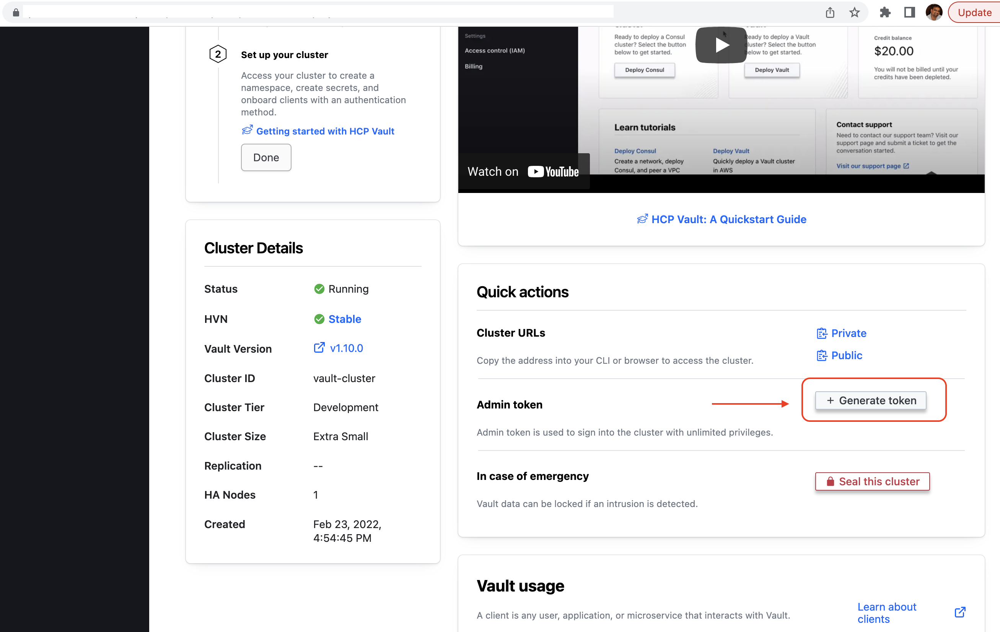

# F5 BIG-IP HCP Vault Integration

This repo uses HashiCorp Vault to manage SSL Certificates

# Architecture


# What does the repo uses ?
- Repo uses F5 BIG-IP VE Version 14.X 
- HashiCorp HCP Vault https://portal.cloud.hashicorp.com

# How to use Repo ?
- Git Clone repo using ``` https://github.com/f5devcentral/f5-certificate-rotate.git ```
- change directory ``` cd f5-certificate-rotate/f5_hcp_vault ```
- deploy ``` terraform init && terraform plan && terraform apply -auto-approve ```
- This will deploy F5 BIG-IP instance & install Vaulti agent  on ubuntu on AWS
- SSH into the ubuntu server and cd/tmp
- Configure vault and use vault agent
```

# Copy the HCP Vault address from the Vault Cluster
export VAULT_ADDR="https://vault-cluster.vault.some-40ed-9b82-f58d39eb209e.aws.hashicorp.cloud:8200"

# Create a new Namespace or point Vault client to existing namespace, here example is admin/f5dev
export VAULT_NAMESPACE="admin/f5dev"

```

### Generate admin token from HCP Vault


```
# Export the Vault token so that vault agent can access HCP vault through CLI 
export VAULT_TOKEN=<cut_and paste_token>

# List vault scerets to tests the communication between vault client and HCP vault.
vault secrets list 

# Change directory to see all your files which are ulploaded using terraform
cd /tmp

# update agent file  agent-config.hcl on the vault-agent  with HCP Vault address
 

vault {
   address = "http://127.0.0.1:8200" <----Change this address in the file
}

```
### Configure PKI for Intermediate Certificate with roles, TTL etc
```vault write pki_int/roles/web-certs allowed_domains=demof5.com ttl=160s max_ttl=30m allow_subdomains=true```


```
# Enable auth method as AppRole 
vault auth enable approle

# Upload app policy to HCP Vault
vault policy write app-pol app-pol.hcl

# Attach the policy to the AppRole web-certs
vault write auth/approle/role/web-certs policies="app-pol"

# Vault agent reads the role-id from HCP Vault after authenticating using admin token
vault read -format=json auth/approle/role/web-certs/role-id | jq -r '.data.role_id' > roleID

# Vault agent gets the secret token with the role-id 
vault write -f -format=json auth/approle/role/web-certs/secret-id | jq -r '.data.secret_id' > secretID

```
### Run Vault agent to generate the http.json and cert.json using template files http.tpl & cert.tpl
```vault agent -config=agent-config.hcl -log-level=debug```

```
# stuff.sh is simple shell script which makes API call to BIG-IP
 Run the command ``` bash stuff.sh ``` this will deploy the AS3 rpm  & VIP with certs on BIG-IP

```

```
# The previous step was done to configure VIP, Pool members on BIG-IP, we need to uncomment the command in
the agent file so that, when the Certs get expired updt.sh script update the Certs on BIG-IP

Stop the vault agent and uncomment ``` command = "bash updt.sh" ``` in the file agent-config.hcl 

# Run the start the agent again so it keeps updating the Certs forever when they are about to get expired
Run ``` vault agent -config=agent-config.hcl -log-level=debug ``` to update the certs automatically
```
